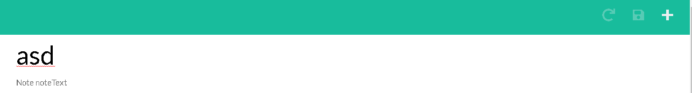
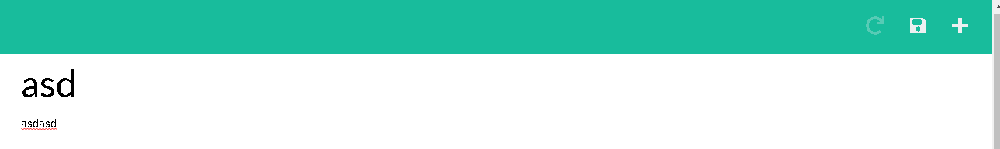
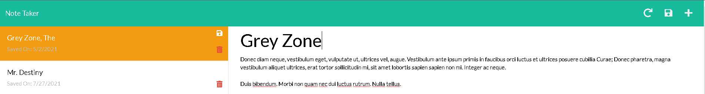
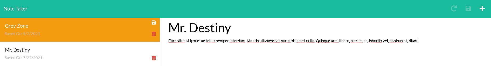
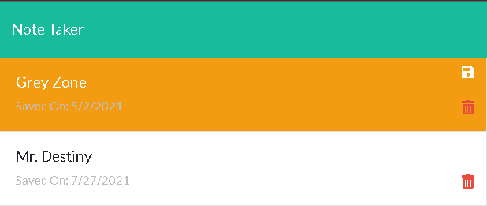

# Note Taker
[](./LICENSE)
[](https://nodejs.org/)
[](https://getbootstrap.com/)
[](https://lodash.com/)
[](https://svelte.dev/)
[](https://vitejs.dev/)
[](https://expressjs.com/)
## Table Of Contents
* [Description](#description)
* [Roadmap](#roadmap)
* [Installation](#installation)
  * [Dependancies](#dependancies)
  * [Clone](#clone)
  * [Zip](#zip)
  * [Frontend Install](#frontend-install)
* [Usage](#usage)
  * [Starting](#starting)
  * [Starting Frontend](#starting-frontend)
  * [Production Frontend](#production-frontend)
  * [Take A New Note](#take-a-new-note)
  * [Update Notes](#update-notes)
  * [Update State Stays](#update-state-stays)
  * [Delete Notes](#delete-notes)
* [Lessons](#lessons)
  * [First Svelte Project](#first-svelte-project)
  * [CORS](#cors)
  * [Testing](#testing)
  * [Vite](#vite)
* [Contact Me](#contact-me)
* [License](#license)
## Description
A note taker that saves the notes on the server side so that you can add to 
and review later.  Created with Express for the backend and Svelte on the 
frontend.  What could go wrong!  Utlizing Vite as a frontend development server 
for Hot loading to make development a BREEZE!  This was my first real project 
with Svelte and it takes all things good from React and Vue and lower the time 
it takes for everything to render.  The Store to manage state was so simple that 
I ended up over thinking it.  I posted my experiences at the end!  This was a blast!
You can check it out [here](https://serve-meh-notes.herokuapp.com/)
## Roadmap
* [x]  Create a new Note
* [x]  Read saved notes
* [x]  Update saved notes
* [x]  Delete saved notes
* [x]  New Note button is only available when content is shown below
* [x]  Save note is only available when content has been updated or is not saved
* [x]  Revert button is only available when viewing saved content that has been altered.
* [x]  Altered notes that are not saved but moved to a different note are temp saved
## Installation
You will need to have Nodejs installed along with Node Package Manager(NPM)  You can 
find some links below on how to install Node and NPM on Windows, Linux, and macOS.
### Dependancies
[](https://nodejs.org/en/download/)
* [How to Install Node.js and NPM on Windows - phoenixNAP](https://phoenixnap.com/kb/install-node-js-npm-on-windows)
* [How to install Node.js and npm on macOS - newline](https://www.newline.co/@Adele/how-to-install-nodejs-and-npm-on-macos--22782681)
* [How To Install Node.js on Ubuntu 20.04 - DigitalOcean](https://www.digitalocean.com/community/tutorials/how-to-install-node-js-on-ubuntu-20-04)
### Clone
Assuming you have Node and NPM you can clone this GitHub repo, go into the directory, 
and install the package.json file with NPM.
```bash
git clone https://github.com/DevJonTaylor/serve-meh-notes.git
cd sweaty-shell-team
npm install
```
### Zip
Another method is to download the zip file, unzip the contents to a specific directory 
and install the package.json file.

These commands that work on all three. (Windows, macOS, Linux) assuming they have 
curl & tar.  Which newer version of Windows have.
```bash
curl -L -o serve_meh_notes.zip https://github.com/DevJonTaylor/serve-meh-notes/archive/refs/heads/main.zip
unzip serve_meh_notes.zip
cd serve-meh-notes-main
npm install
```
### Frontend Install
After you install the repo the frontend can be installed by going to public/frontend and 
installing the package.  
```bash
cd public
cd frontend
npm install
```


## Usage
Feel free to check out a live demo [here](https://serve-meh-notes.herokuapp.com/).  If you have everything installed then...
### Starting
To start the backend server just run the below command
```bash
npm start
```
### Starting Frontend
Vite provides a fantastic dev server with hot reloading.  So as you make edits it makes
adjustments to the code in the browser so you hardly ever have to reload the browser.
```bash
npm run frontend:dev
```
### Production Frontend
```bash
npm run frontend:build
```
Then move the js files to the public/assets/js folder and the css files to the 
public/assets/css folder.  After that move the index.html to the notes.html spot in 
public.  Be sure to adjust the css and js locations in the html file.
```html
<!DOCTYPE html>
<html lang="en">
<head>
  <meta charset="UTF-8">
  <meta name="viewport" content="width=device-width, initial-scale=1.0">
  <meta http-equiv="X-UA-Compatible" content="ie=edge">
  <title>Note Taker</title>
  <link rel="stylesheet" href="https://cdnjs.cloudflare.com/ajax/libs/bootswatch/4.1.3/flatly/bootstrap.min.css">
  <link rel="stylesheet" href="https://use.fontawesome.com/releases/v5.3.1/css/all.css" integrity="sha384-mzrmE5qonljUremFsqc01SB46JvROS7bZs3IO2EmfFsd15uHvIt+Y8vEf7N7fWAU" crossorigin="anonymous">
  <!-- The locations are located right below here -->
  <script type="module" crossorigin src="./assets/js/index.8f3087b6.js"></script>
  <link rel="modulepreload" href="./assets/js/vendor.4c648e97.js">
  <link rel="stylesheet" href="./assets/css/vendor.5e1fe644.css">
  <link rel="stylesheet" href="./assets/css/index.e969c31b.css">
  <!-- The locations are located right above here -->
</head>
<body>
<div id="app"></div>
<script src="https://cdn.jsdelivr.net/npm/jquery@3.5.1/dist/jquery.slim.min.js" integrity="sha384-DfXdz2htPH0lsSSs5nCTpuj/zy4C+OGpamoFVy38MVBnE+IbbVYUew+OrCXaRkfj" crossorigin="anonymous"></script>
<script src="https://cdn.jsdelivr.net/npm/bootstrap@4.6.1/dist/js/bootstrap.bundle.min.js" integrity="sha384-fQybjgWLrvvRgtW6bFlB7jaZrFsaBXjsOMm/tB9LTS58ONXgqbR9W8oWht/amnpF" crossorigin="anonymous"></script>

</body>
</html>
```
### Take a new note
The icons in the top right will be faded out based on the current options.  If you are creating a new note and everything is empty


The moment either you are viewing another note or are have text below either in the title or note itself you have the option to press the new note button



If you would like to save a note you have to have title and text in place they cannot be empty

### Update notes
To update a note you can select a note on the left and alter the saved note.  If the note has been altered you will see the left move the current note to the top and the background will be orange.  Simply save the note by click the disk.

### Update state stays
If you are updating a note and click on another note the note's changes are saved and left orange on the left side.  You can click the disk on the left or load the note back up and continue making changes by click on the note again.  If at any point you want to go back to the original saved note simply click the refresh button on the top right.

### Delete notes
If you would like to delete a note at any point just click the trashcan on the left side and it will remove a note.

## Lessons

### First Svelte Project
I have worked with React and Vue before.  I am really a huge fan of Vue, but keep hearing all of this hype about Svelte.  So what better way to learn to make something right?  I was mostly impressed with the ease of setup to get working directly with with a project.  It is not easy to implement a Svelte project into a co-existing project, so I opted to allow it full control of the page itself.  The pure speed is actually noticable just looking at the hot reloads.  There are small delays with React and Vue not HUGELY noticable, but enough if you pay attention you'll see it.  The store management is a great deal easier once you understand how it works.  It was a small "lets figure this out" moment, but that can be said with both React and Vue.  The difference here is that I did not have to follow a drawn out tutorial as I did with both Vuex and Redux.

### CORS
This simple header can be easy fix and a huge point of frustration.  It is really important point of security that your browser follows, even though my frontend server is localhost and my backend is localhost with the different ports makes them different servers.  So I ran into this problem, when I generally do I take my time to learn everything I can.  CORS is simply a server side header that is sent back to the browser and the browser will ignore the response if they are do meet the requirements.  This intended behavior is important to keep evil code from reaching out to other servers.  The simple fix is to have your server provide exception which is a header that states the localhost:3000.  You could also put *, but this defeats the point of the security protocal.

### Testing
I actually ran into a huge issue with this.  I started to add tests to the routes and Svelte, however Svelte is really new and the tests are a bit confusing.  I need to do some more research and figure out a better understanding of Jest, unit testing, and how to implement unit tests for routes and Svelte.  I do not normally bad down from a challenge like this, but I felt like the unit testing was stopping all learning and would be better placed in a different project.

### Vite
Vite was so fast and small compared to Webpack and their Hot Reloading.  Extremely impressed and will probably opt to use Vite over Webpack in the future.  The setup, lack of module requirements and there was no tutorial needed.  You literally just create the project using Vite and poof setup is done.  Was just so much easier!  Provides support for React, Vue, Svelte, and TypeScript.  I will be exploring options in the future for sure.

## Contact Me

- **Phone/SMS**: [(512)740-9784](tel:+15127409784/)
- **Email**: [jonnytest1101@icloud.com](mailto:jonnytest1101@icloud.com)
- **GitHub**: [@DevJonTaylor](https://www.github.com/devjontaylor)
- **LinkedIn**: [Vue-Shell](https://www.linkedin.com/in/vue-shell)


## License

[](./LICENSE)
